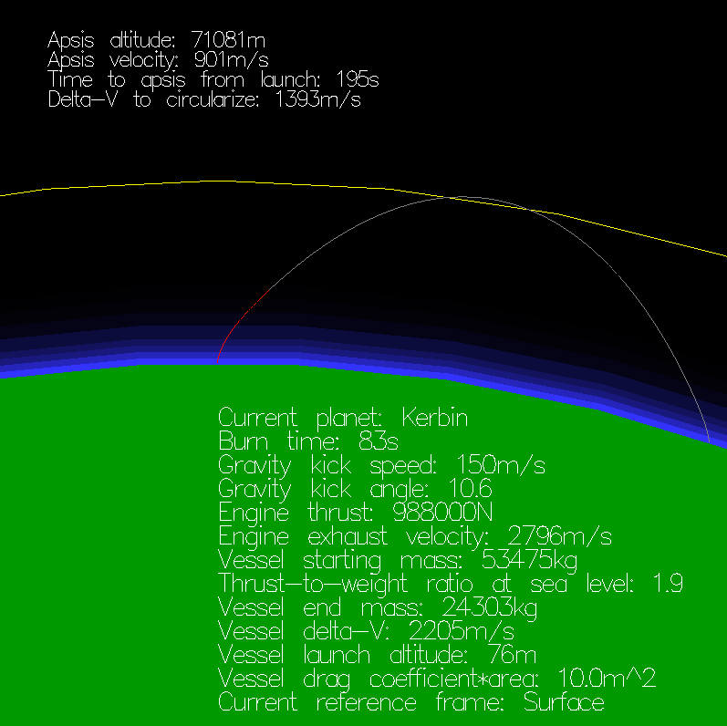

microksp
========

Gravity turn simulation.



Build
-----

Debian-based Linux distributions:

```
sudo apt install freeglut3-dev haskell-stack
cd microksp
stack setup
stack build
```
Then use `stack run` to run the program.

Controls
--------

- up/down : increase/decrease gravity kick velocity
- right/left : increase/decrease gravity kick angle
- lshift/lctrl : increase/decrease engine thrust
- p : cycle through planets
- x/z : scale image size up/down
- r : switch reference frame between Surface and Orbit
- w/s : increase/decrease vessel delta-V
- d/a : increase/decrease vessel cross-section area or drag coefficient

License
-------
GPL-3.0-or-later
